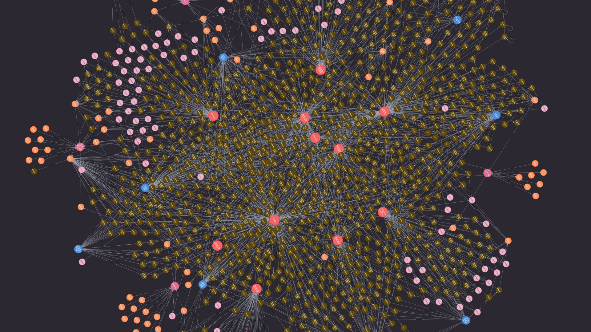
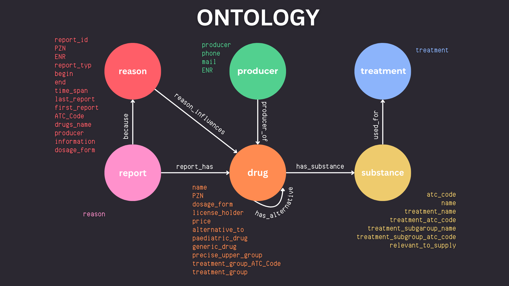

  <h1 align="center">Pharmaceutical Supply Shortages - Knowledge Graph</h1>

  

    This project was part of a university module at KIT for Industrial Engineering
  

<!-- TABLE OF CONTENTS -->

  
Table of Contents

  <ol>
    <li>
      <a href="#about-the-project">About The Project</a>
      <ul>
        <li><a href="#built-with">Built With</a></li>
      </ul>
    </li>
    <li>
      <a href="#getting-started">Getting Started</a>
      <ul>
        <li><a href="#prerequisites">Prerequisites</a></li>
        <li><a href="#installation">Installation</a></li>
      </ul>
    </li>
    <li><a href="#usage">Usage</a></li>
    <li><a href="#roadmap">Roadmap</a></li>
    <li><a href="#contributing">Contributing</a></li>
    <li><a href="#license">License</a></li>
    <li><a href="#contact">Contact</a></li>
    <li><a href="#acknowledgments">Acknowledgments</a></li>
  </ol>

<!-- ABOUT THE PROJECT -->
## 📋 About The Project
This project focuses on analyzing pharmaceutical supply chain disruptions in Germany using a **Neo4j Knowledge Graph**.

📊 Data used
* [BFARM Public Database](https://anwendungen.pharmnet-bund.de/lieferengpassmeldungen/faces/public/meldungen.xhtml): Contains reports of drug shortages in Germany.
* DKV Web Scraper: Extracted data using [this web scraper tool](https://github.com/HiAmara/webscraper-for-teamprojekt).

Timeframe of the data was 2017 to 2023.

 

📈 Graph Structure  
The knowledge graph consists of the following key components:
* Nodes: Reports, Drugs, Reasons, Producers, Substances, Treatments.
* Relationships: Shortages (report_has), causality (because and reason_influences), alternatives (has_alternative), producing (producer_of), containing substances (has_substance), according treatments (used_for).

(<a href="#readme-top">back to top</a>)

<!-- GETTING STARTED -->
## Getting Started

### 🛠️ Prerequisites

Before using this repository, ensure you have the following installed:
* [Neo4j](https://neo4j.com/)
* Access to Jupyter Notebooks

(<a href="#readme-top">back to top</a>)

<!-- USAGE EXAMPLES -->
## 🔧 Usage
* Download the Datasets and add their paths to the Script
* To build the Knowledge Graph in Neo4j just follow the Script
* Once the Knowledge Graph is built, you can run the prepared Queries or make your own

(<a href="#readme-top">back to top</a>)

<!-- ROADMAP -->
## 📷 Example Visualizations

(<a href="#readme-top">back to top</a>)

<!-- LICENSE -->
## License

Distributed under the Unlicense License. See `LICENSE.txt` for more information.

(<a href="#readme-top">back to top</a>)

<!-- CONTACT -->
## Contact

uyvep@student.kit.edu

Project Link: [https://github.com/HiAmara/knowledge-graph](https://github.com/HiAmara/knowledge-graph)

(<a href="#readme-top">back to top</a>)

